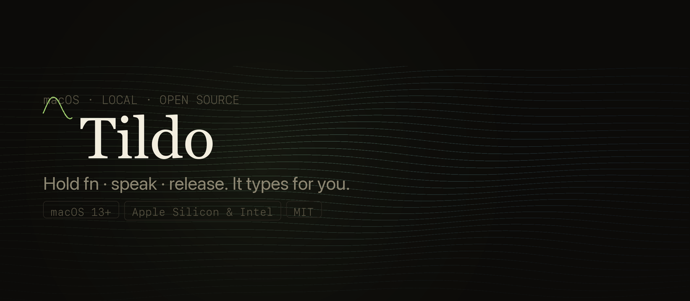

# Tildo



**Speak. It types.** A macOS menu bar app that turns your voice into text — right where your cursor is. No cloud, no subscriptions, no data leaving your Mac.

Built on [OpenAI's Whisper](https://github.com/openai/whisper) running locally via [whisper.cpp](https://github.com/ggerganov/whisper.cpp).

---

## Why Tildo?

- **100% private** — Everything runs on your Mac. Your audio never leaves the device.
- **Works everywhere** — Text appears wherever your cursor is: emails, code editors, Slack, browsers, terminal. Any app.
- **One hotkey** — Press your shortcut, talk, done. No window switching, no copy-pasting.
- **Actually fast** — Whisper runs natively on Apple Silicon. A 30-second recording transcribes in under 2 seconds with the right model.
- **Free and open source** — No subscriptions, no monthly fees. LLM post-processing is optional and uses your own API keys.

## Features

**Two ways to dictate**
- **Batch** — Record everything, then transcribe at once. Great for long thoughts.
- **Live** — See your words appear in real-time as you speak.

**16 languages**
Auto-detects or you choose: English, Spanish, French, German, Italian, Portuguese, Chinese, Japanese, Korean, Russian, Arabic, Hindi, Dutch, Polish, Turkish.

**Pick your model**
21 Whisper models from Tiny (32 MB) to Large v3 Turbo (1.6 GB). Download and switch from within the app. Quantized versions (Q5, Q8) give you a good balance of speed and accuracy.

**LLM post-processing**
Optionally pass transcribed text through an AI model to correct, reformat, or translate. Works with OpenAI, Anthropic, Groq, or Claude Code (no API key needed if you already have it installed).

**Per-app tones**
Define custom AI instructions per application — formal in email, casual in Slack, technical in your IDE. URL-pattern matching for browsers.

**Text replacements**
Substitutions applied after transcription: "arroba" → "@", "hashtag" → "#", or anything you define.

**Keyboard shortcuts**
Assign any key combination for record and cancel-recording from Settings → Atajos. Live key-cap feedback while pressing, 3-second hold-to-confirm.

**And more**
- Auto-stops when you go silent (configurable timeout)
- Sound feedback on start and stop
- Searchable transcription history

## Installation

Download the latest `Tildo-x.x.x-arm64.zip` from the [Releases page](../../releases/latest), unzip it, and move `Tildo.app` to your Applications folder.

**First launch — macOS will block it** because the app isn't notarized. Three ways to open it:

**Option A — System Settings (recommended on macOS 15 Sequoia)**
Try to open the app normally. macOS will block it. Go to **System Settings → Privacy & Security**, scroll down, and click **Open Anyway**.

**Option B — Right-click (macOS 14 Sonoma)**
Right-click `Tildo.app` → **Open** → click **Open** in the dialog. Only needed once. Does not work on macOS 15.

**Option C — Terminal**
```bash
xattr -cr /Applications/Tildo.app
```

### Permissions

Tildo needs two permissions:

- **Microphone** — To record your voice. macOS will prompt on first launch.
- **Accessibility** — To type text into other apps. Go to **System Settings → Privacy & Security → Accessibility** and enable Tildo.

Without Accessibility access the app transcribes normally but can't insert text — you'll need to paste manually (Clipboard output mode still works).

## Build from source

**1. Build the whisper.cpp framework**

```bash
git clone https://github.com/ggerganov/whisper.cpp
cd whisper.cpp
cmake -B build -DBUILD_SHARED_LIBS=ON -DCMAKE_OSX_ARCHITECTURES="arm64"
cmake --build build --config Release
```

Package it and place it in `Frameworks/`:

```bash
xcodebuild -create-xcframework \
  -library build/src/libwhisper.dylib \
  -headers include/ \
  -output Frameworks/whisper.xcframework
```

**2. Build**

```bash
bash build.sh
open Tildo.app
```

Or open `Package.swift` in Xcode.

**3. Download a model**

On first launch, go to Settings → Modelos:

| Goal | Model | Size |
|------|-------|------|
| Fastest | Base Q5 | 60 MB |
| Balanced | Small Q5 | 190 MB |
| Best accuracy | Large v3 Turbo Q5 | 574 MB |

## Built with

- [whisper.cpp](https://github.com/ggerganov/whisper.cpp) — C/C++ port of OpenAI Whisper
- [SwiftUI](https://developer.apple.com/xcode/swiftui/) — Native macOS UI
- [AVFoundation](https://developer.apple.com/av-foundation/) — Audio capture
- [CoreGraphics](https://developer.apple.com/documentation/coregraphics) — Keystroke simulation

## License

MIT
